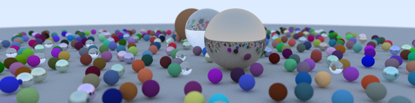
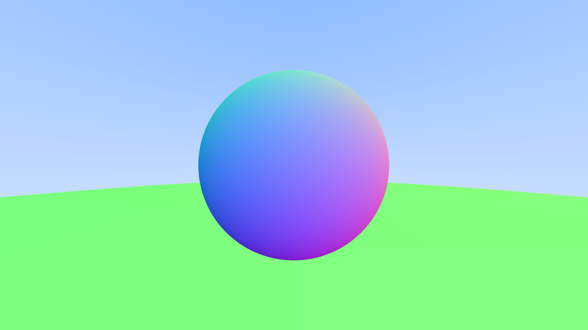
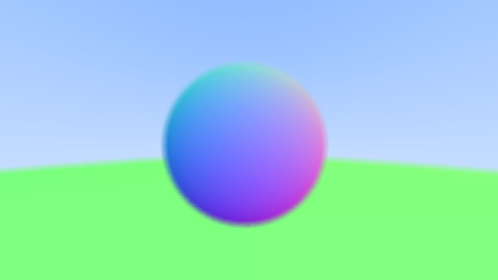
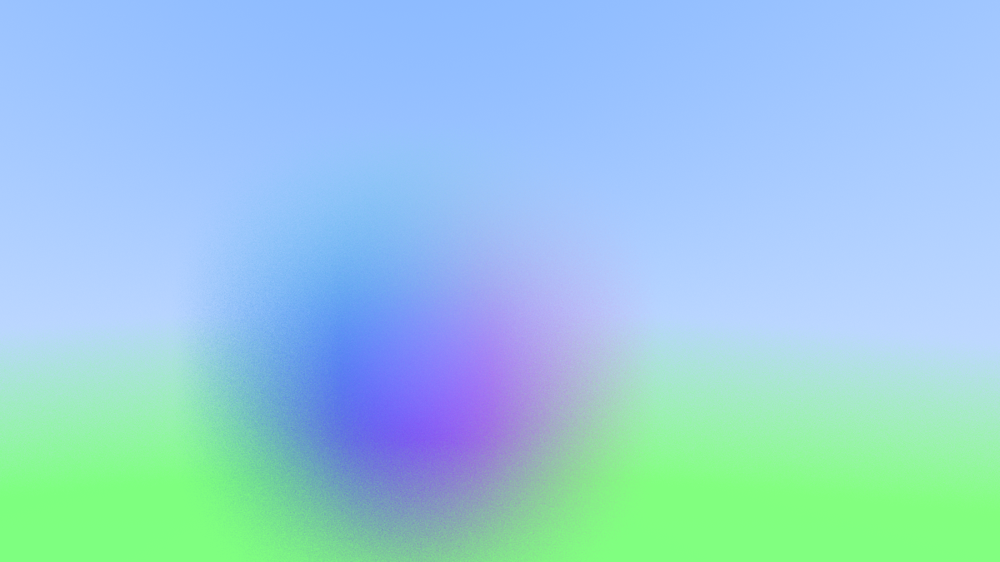
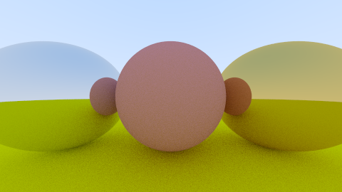
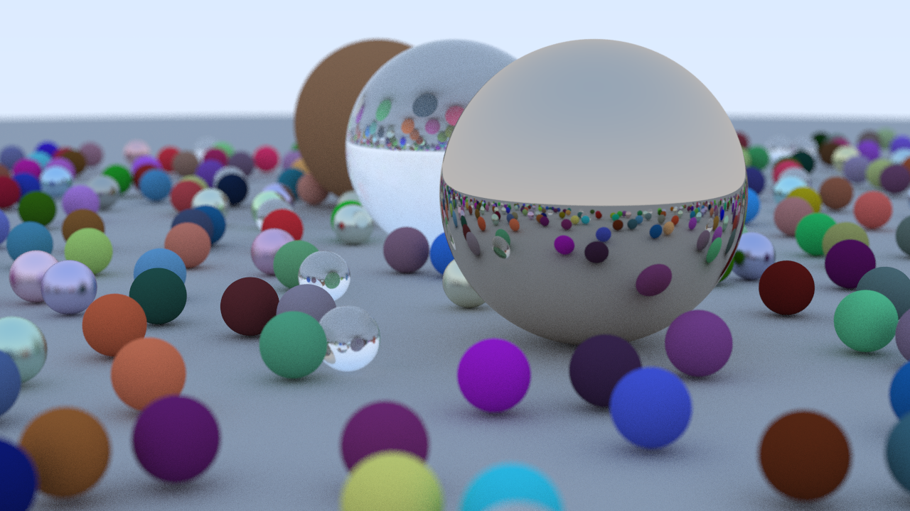

# Exploring Raytracing

<div>
    <table width = 100%>
        <tr>
            <td width = 30%>
                <ul>
                    <div></img> JElledgeCG@gmail.com</div>
                    <div></img> @JElledgeCG</div>
                    <div></img> Github Pages</div>
                    <div></img> Josh E#6435</div>
                    <div></img> LinkedIn</div>
                </ul>
            </td>
            <td width = 70%>
                </img>
            </td>
        </tr>
    </table>
</div>

<p align="left">
  <a href="#introduction">Introduction</a> •
  <a href="#part-i-ray-tracing-in-one-weekend">PART I: Ray Tracing in One Weekend</a> •
  <a href="#part-ii">Part II</a> •
  <a href="#credits">Credits</a>
</p>

## Introduction

Welcome to Exploring Raytracing! As part of my computer graphics journey, I've decided to dive into offline raytracing as a starting point for understanding PBR. This repo serves as a devlog and progress tracker where I can store code, thoughts about what I'm learning, and plans for the future of this project!

## PART I: Ray Tracing in One Weekend

To begin, I decided to follow along with the book "Ray Tracing in One Weekend" by Peter Shirley and build a raytracer from scratch in C++. This resource was very useful and taught me many things. Much of the code in this repo comes directly from this source (and has been marked as such), but I still learned enough to understand the concepts and algorithms and to be inspired to extend the renderer (see Part II). Below are some key learnings and thoughts that I had while following along:

### Rays

The early chapters of "Ray Tracing in One Weekend" immediately showcase one of the benefits of raytracing over rasterization: *SIMPLICITY*. For each pixel in the target output, a ray is cast from the camera through pixels in a virtual viewport and into the scene. The function performing the raycast returns a color for the pixel based on what the ray collided with, if anything. 

In order to determine whether a ray collides with anything (and what it collides with), each ray must be tested against each object in the scene for intersection (for now). The raytracer that I ended up with after completing chapter 6 introduced a test for ray-sphere intersection. This test involves clever algebra that leads to a quadratic equation with unknown t, where t is the distance along the ray where it intersects with the target sphere. Calculating the discriminant of this equation leads to an easy intersection test - if the discriminant is greater than 0, the sphere will be hit; otherwise, it will not. This led to the following code for sphere intersection and raycasting:

```
double hit_sphere(const point3& center, double radius, const ray& r) {
    vec3 oc = r.origin() - center;
    auto a = dot(r.direction(), r.direction());
    auto b = 2.0 * dot(oc, r.direction());
    auto c = dot(oc, oc) - radius*radius;
    auto discriminant = b*b - 4*a*c;

    if (discriminant < 0) {
        return -1.0;
    } else {
        return (-b - sqrt(discriminant) ) / (2.0*a);
    }
}

color ray_color(const ray& r) {
    auto t = hit_sphere(point3(0,0,-1), 0.5, r);
    if (t > 0.0) {
        vec3 N = unit_vector(r.at(t) - vec3(0,0,-1));
        return 0.5*color(N.x()+1, N.y()+1, N.z()+1);
    }
    vec3 unit_direction = unit_vector(r.direction());
    t = 0.5*(unit_direction.y() + 1.0);
    return (1.0-t)*color(1.0, 1.0, 1.0) + t*color(0.5, 0.7, 1.0);
}
```

This code models basic raytracing of a sphere, using the surface normal of the sphere at the location hit by each ray as the returned ray color:

</img>

### Antialiasing and Blur

Chapter 7 describes antialiasing for our raytracing algorithm. The idea is very straightforward and was very interesting to learn about: For each pixel, rather than send one ray into the center of the pixel, send several rays, each with a random offset within some range. Making this range 0 results in no antialiasing. Going within a 1 pixel range in both the x and y direction results in  antialiasing that removes the terrible jagged edges from the previous image:

</img>

I started experimenting with this, and realized that by increasing the range that the random offset can be generated (I called this "blur factor" in my code) results in a very convincing and very simple blur:

</img>
</img>

*Left: 200 samples per pixel, blur factor 10. Right: 200 samples per pixel, blur factor 100.*

### Shading and Materials

While the surface-normals-colored sphere is pretty, it's lacking the depth that we would expect from a 3d scene. This depth is achieved with shading. When a ray collides with an object, instead of just returning a set color, we will instead have the ray "scatter" in a new direction. The returned color is then a blend between the color and light attenuation of the object hit and the color returned by the scattered child ray. This is a recursive process, and we limit recursion depth with a hyperparameter to avoid consuming the entire stack. Below is the new `ray_color()` function that takes this behavior into account:

```
color ray_color(const ray& r, const hittable& world, int depth) {
    hit_record rec;

    if (depth <= 0)
        return color(0, 0, 0);

    if (world.hit(r, 0.001, infinity, rec)) {
        ray scattered;
        color attenuation;
        if (rec.mat_ptr->scatter(r, rec, attenuation, scattered))
            return attenuation * ray_color(scattered, world, depth - 1);
        return color(0, 0, 0);
    }
    vec3 unit_direction = unit_vector(r.direction());
    auto t = 0.5 * (unit_direction.y() + 1.0);
    return (1.0 - t) * color(1.0, 1.0, 1.0) + t * color(0.5, 0.7, 1.0);
}
```

A few interesting things to notice:
- When the maximum number of child rays has been reached, black is returned. This makes sense intuitively because once a sufficient number of "bounces" have occurred, it can be inferred that the ray is bouncing in a tight area between close objects - which would cast a shadow!
- If nothing is hit, the ray will return our skybox gradient from before.
- The "scatter" function is virtual and is overridden by each material that we implement. The material also determines the color and attenuation of the object that has been hit.
- Attenuation determines how much the light has been reduced per bounce. This mimics the real world, as objects absorb light and consecutive bounces reduce the intensity of the emitted light.

### Materials: Diffuse

The first material implemented was a lambertian diffuse material. Diffuse materials mix their own color with the color of their surroundings. To mimic this, the scattering function for our diffuse material is as follows:

```
class lambertian : public material {
    public:
        lambertian(const color& a) : albedo(a) {}

        virtual bool scatter(const ray& r_in, const hit_record& rec, color& attenuation, ray& scattered) const override {
            auto scatter_direction = rec.normal + random_unit_vector();

            // Catch degenerate scatter direction
            if (scatter_direction.near_zero())
                scatter_direction = rec.normal;

            scattered = ray(rec.p, scatter_direction);
            attenuation = albedo;
            return true;
        }
    public:
        color albedo;
};
```
The direction for the child ray is a unit vector within a unit sphere that is tangent to the point of intersection between the parent ray and the object. There are two such spheres. Intuitively, the sphere on the outside of the object is chosen, as light won't scatter *through the surface* of the object, but rather will scatter away from the point of impact. By setting attenuation = the color of the object, objects with the diffuse material will be shaded as decribed earlier. Here is a HD render of a diffuse sphere on a diffuse ground:

</img>

### Gamma Correction

COMING SOON

### Materials: Metal

Metal objects differ from diffuse in the way rays are scattered. For smooth metals, a ray is not randomly scattered, but is instead reflected. This gives metals a mirror finish, and other objects in the scene can be seen on the surfaces of metals, especially smooth metals. If all metals were completely smooth, we could simply reflect an incoming ray along the surface normal of the point of impact. However, most metals are not completely shiny and smooth and have a degree of diffuse to them. The following implementation of a metal material takes this into account by adding a "fuzz" parameter to metal creation:

```
class metal : public material {
    public:
        metal(const color& a, double f) : albedo(a), fuzz(f < 1 ? f : 1) {}

        virtual bool scatter(const ray& r_in, const hit_record& rec, color& attenuation, ray& scattered) const override {
            vec3 reflected = reflect(unit_vector(r_in.direction()), rec.normal);
            scattered = ray(rec.p, reflected + fuzz * random_in_unit_sphere());
            attenuation = albedo;
            return (dot(scattered.direction(), rec.normal) > 0);
        }

    public:
        color albedo;
        double fuzz;
};
```

The fuzz of a metal is clamped between 0 and 1. A metal with 0 fuzz will be perflectly smooth and reflect like a mirror:

</img>

*Both of the outside spheres have 0 fuzz, the middle sphere is diffuse.*

A metal with fuzz 1 will be perfectly diffuse. Fuzz values between 0 and 1 give realistic variety of metal reflections:

</img>

### Materials: Dielectric

The final material type for this iteration of the raytracer is a dielectric. A dielectric is any material that sometimes relfects, as we saw with metals, but at other times *refracts*, or passes light through the material (glass, water, etc). Refraction is not a direct pass-through - the ray is "bent" into the object as it passes through and is modelled according to Snell's Law. This is implemented in the following refraction function:

```
vec3 refract(const vec3& uv, const vec3& n, double etai_over_etat) {
    auto cos_theta = fmin(dot(-uv, n), 1.0);
    vec3 r_out_perp = etai_over_etat * (uv + cos_theta * n);
    vec3 r_out_parallel = -sqrt(fabs(1.0 - r_out_perp.length_squared())) * n;
    return r_out_perp + r_out_parallel;
}
```
Now that we *CAN* refract, it's time to determine *WHEN* to refract vs reflect. When a ray is in the material with a higher refractive index, Snell's Law has no real solution. In this case, we must reflect instead. In addition, reflectivity in the real world varies with angle. Rather than deal with the very complicated math that comes with this, most reflectance is approximated using Christophe Schlick's polynomial approximation of the phenomenon:

```
static double reflectance(double cosine, double ref_idx) {
    auto r0 = (1 - ref_idx) / (1 + ref_idx);
    r0 = r0 * r0;
    return r0 + (1 - r0) * pow((1 - cosine), 5);
}
```

Putting all of this together, we're left with the following scattering function for dielectrics:
```
class dielectric : public material {
    public:
        dielectric(double index_of_refraction) : ir(index_of_refraction) {}

        virtual bool scatter(const ray& r_in, const hit_record& rec, color& attenuation, ray& scattered) const override {
            attenuation = color(1.0, 1.0, 1.0);
            double refraction_ratio = rec.front_face ? (1.0 / ir) : ir;

            vec3 unit_direction = unit_vector(r_in.direction());
            double cos_theta = fmin(dot(-unit_direction, rec.normal), 1.0);
            double sin_theta = sqrt(1.0 - cos_theta * cos_theta);

            bool cannot_refract = refraction_ratio * sin_theta > 1.0;
            vec3 direction;

            if (cannot_refract || reflectance(cos_theta, refraction_ratio) > random_double())
                direction = reflect(unit_direction, rec.normal);
            else
                direction = refract(unit_direction, rec.normal, refraction_ratio);

            scattered = ray(rec.p, direction);
            return true;
        }
    public:
        double ir;

    private:
        static double reflectance(double cosine, double ref_idx) {
            auto r0 = (1 - ref_idx) / (1 + ref_idx);
            r0 = r0 * r0;
            return r0 + (1 - r0) * pow((1 - cosine), 5);
        }
};
```
In addition, the book showcases and interesting use case for dielectrics: a hollow glass sphere, or bubble. This can be done by placing a smaller glass sphere inside of a larger, but inverting its radius. This makes the normals face inward, giving a "fishbowl" type appearance:

</img>

Putting all three materials together in a random scene, I was able to render this HD image:

</img>

### Part I Conclusions and Next Steps

While I am happy with the way this renderer turned out, there are still many things I want to learn, fix, and add to this raytracer:

1. Performance. While raytracing is pretty, even with this relatively simple implementation, it is painfully slow as the scene gains more geometry. While I could render 4k images for simpler scenes, when I tried to redner a 4k version of the final random scene, it took 8 hours of computing to only finish about 40% of the image. I could not be bothered to wait for the other 60%, and immediately began wondering about ways to increase performance. I want to be able to do renders of complex scenes and models once I implement ray-triangle intersection and model loading, but some restructuring and optimizing will need to be done first.

2. Features. Spheres can only be used to represent so many objects, and they are definitely not the ideal 3D primitive. I want to implement ray-triangle intersection and model loading to accompany it. In addition, I want to add direct lighting and texturing in order to render more dramatic and interesting scenes.

This concludes Part I of Exploring raytracing. In Part II, I will implement bounding volumes and parallelize my code in order to dramatically increase performance.

## Part II: Optimization and Performance

COMING SOON

## Credits

Credit Section
